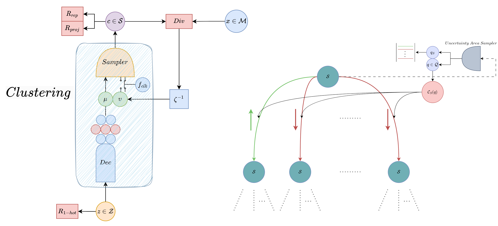
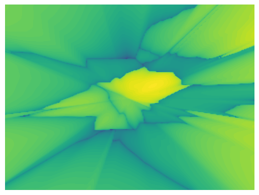

# GeoCluster: A latent variable generative model for continuous space geometric clustering

Minas Dioletis, Ioannis Z. Emiris, George Ioannakis, Evanthia Papadopoulou, Thomas Pappas, Panagiotis Repouskos,
Panagiotis Rigas, and Charalampos Tzamos


Figure: Proposed Network. (a) illustrates the network topology, for the construction of a node
in the hierarchical tree T. (b) showcases the critic network assigning weights in edges of a graph

## Table of Contents
- [Method](#method)
- [Installation](#installation)
- [Code Structure](#code-structure)
- [Getting Started](#getting-started)
- [License](#license)

## Method

We aim to simplify and optimize the process of finding the nearest neighbor in a set of objects given a query point, and a metric.
Our method employs a latent-variable generative model for hierarchical clustering, creating
a tree structure where nodes represent data space regions, not just centroids.
Critics assess and value the edges in this tree-graph, converting it to a weighted graph for
navigational decision-making by an actor with a policy.
Explicit data embedding in a higher-dimensional space transforms complex shapes into
discrete points, enabling divergence calculations for iterative state refinement.
This approach, termed GeoCluster, dynamically quantifies data, aligning with
its natural structure and distribution, approximating a hierarchical-voronoi structure.

\
Figure: Illustration of a space split into clusters.

Key points of our method are:

- Input Agnostic.
- Simple, since only the metric needs to be defined.
- Fast, since the student is a linear model, and is run on the GPU.
- Great scaling and highly parallelizable

## Installation

Clone the repository and install the required libraries by running the following in your terminal:

```shell
git clone https://github.com/PRigas96/GeoCluster
cd GeoCluster
conda env create -f environment.yml
source activate GeoCluster
```

or if you are a linux user:

```shell
git clone https://github.com/PRigas96/GeoCluster
cd GeoCluster
conda env create -f environment_linux.yml
source activate GeoCluster
```

## Code Structure

```
├─── data                          # directory for data used in experiments
│    ├── squares                   #   square objects (with rotation)
│    ├── cuboids                   #   cuboid objects (without rotation)
│    └── ellipses                  #   ellipses objects (without rotation)
├─── images                        # images used for this README
├─── src                           # contains the source code (more info in src/README.md)
├─── demo.ipynb                    # demo notebook
└─── environment.yml               # Anaconda environment for required libraries (windows)
└─── environment_linux.yml         # Anaconda environment for required libraries (linux) 
```

## Getting Started

### Demo

Use the [demo](demo.ipynb) provided to get familiar and experiment with the algorithm.
The demo uses as input 1000 squares with rotation in 2D and as metric the L<sub>&infin;</sub> distance between a square and a point.

### Parameters

#### Input data
As the algorithm is input-agnostic, any type of data can be utilised as long as they can be embedded in a vector format and can be loaded as a `numpy` array.

#### Space dimension
The space dimension should then be defined.
This will make the *Clustering* model cluster the data around centroids of the specified dimension, as well as allow the *Critic* to make predictions of queries of points in the same dimension.

#### Metric
A metric function should be provided which can calculate the distance between a data vector and a query point as described above.

#### Model parameters
There are two neural network models and one sampler than can need to be parametrised.
See the [demo](demo.ipynb) for a detailed list and a brief explanation of the parameters.
More information can be found in the [models' source code](src/models.py).

#### Termination criteria
Threshold of the number of data contained in a leaf node on the k-tree, for the tree division phase to end.

### Application

1. Load a dataset:
   ```python
   import numpy as np
   dataset = np.load('./your_path/your_data.npy')
   ```
2. Define the space dimension:
   ```python
   dim = 2  # or any integer depending on your data
   ```
3. Define a metric function:
   ```python
   def my_metric(data_entry:[float], point:[float]):
     """Function that calculates the distance between a data entry and a point."""
     ...
   ```
4. Define the arguments for the models and the UN sampler:
   ```python
   clustering_args = {...}
   un_args = {...}
   critic_args = {...}
   ```
5. Define a threshold:
   ```python
   threshold = len(dataset) / 100  # or any number or heuristic that works for your data
   ```
6. Initiate the k-tree:
   ```python
   import torch
   from src.k_tree import Ktree
   
   device = torch.device("cuda:0" if torch.cuda.is_available() else "cpu")
   ktree = Ktree(threshold, dataset, my_metric, clustering_args, un_args, critic_args, device, dim)
   ```
7. Create the tree:
   ```python
   ktree.create_tree()
   ```
8. Run queries for different points in the space dimension defined above:
   ```python
   ktree.query([4, 2])
   ```

## License

This project is licensed under the MIT License - see the LICENSE file for details.
